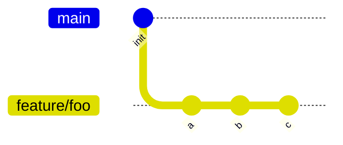
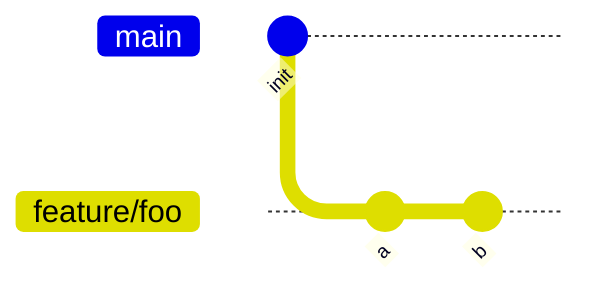
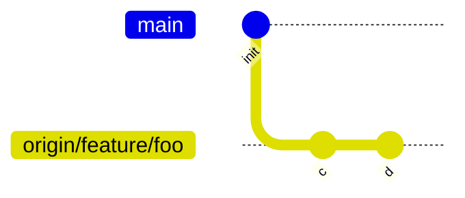
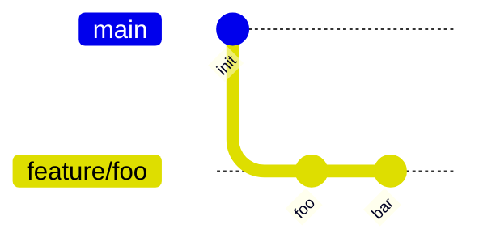
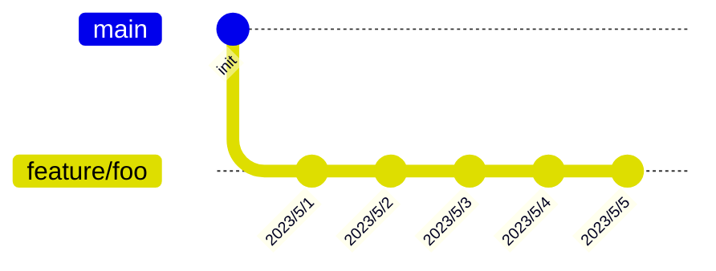
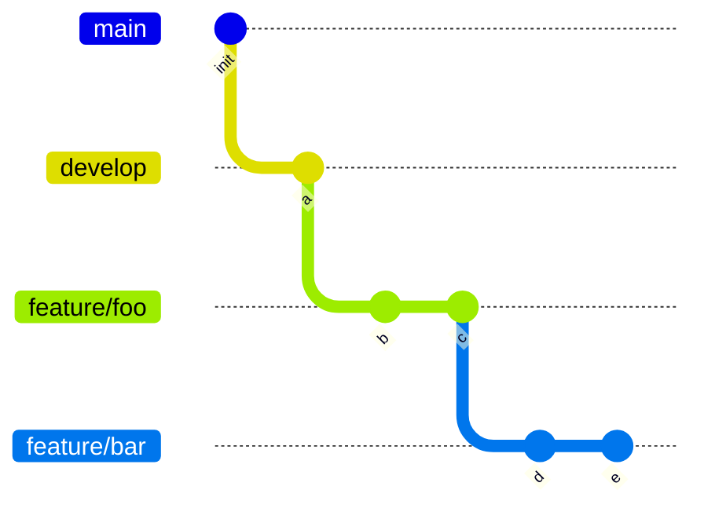

gitコマンド10本ノックの前半です。
git初学者や自信がない方向けです。

## 1本目
あなたはfeature/fooブランチで作業しています。
実装する中で、過去のバージョンのファイルを使って色々と試してみたいことがでてきました。
過去のコミットであるaコミットの時のapp.pyだけを作業ツリーに復元するにはどうすればよいですか？



<details><summary>筆者の回答</summary>

```bash
git checkout a -- app.py
```
</details>

<details><summary>解説</summary>

`git reset a`は不正解です。resetコマンドでは全てのファイルが書き変わってしまいます。
また、`git reset a -- app.py`も不正解です。resetコマンドではpath指定はできないのです。
今回の例ではcheckoutが適切です。
「checkoutはブランチ移動のコマンド」と覚えているとあまりピント来ないかもしれません。
checkoutはブランチ移動ではなく、「指定した状態に書き換えるコマンド」と覚えておくほうが融通が効きます。

例えば、
`git checkout (head) -- app.py`(headは省略可[^1])
は、「app.pyをheadの状態に書き換える」という意味です。
こうすることで、app.pyの変更を破棄できます。[^2]

また、「状態」とは必ずしもブランチやコミットであるとは限りません。checkoutコマンドではこんなことも可能です。
`git checkout stash@{0} -- app.py`

</details>


## 2本目
あなたはfeature/fooブランチで作業しています。
他の作業者がorigin/feature/fooブランチにnon-fast-forwardなコミットをpush -fしました。
どうやらあなたはそれをローカルにpullする必要がありそうです。
どのようにしてローカルにpullしますか？


↓


<details><summary>筆者の回答</summary>

```bash
git stash
git fetch origin/feature/foo
git reset --hard origin/feature/foo
 ```
</details>

<details><summary>解説</summary>

`git pull`ではエラーになってしまいます。 
pullコマンドが内部的に実行するのはfetch+mergeなので、non-fast-forwardなコミットをpullする場合はmerge時にconflictしてしまいエラーになってしまいます。
そこで、mergeではなく強制的にブランチを書き換えてしまうreset --hardコマンドを使うというのが筆者の回答です。
reset --hardコマンドはローカルの作業ツリーの変更が破棄されてしまうので、実行前にgit stashしてます。[^3]

</details>

## 3本目
あなたはfeature/fooブランチで作業しています。
親ブランチからコミット2つ(古い順にfoo, bar)を追加してmainブランチにMR(マージリクエスト)を投げました。
レビュアーからの指摘でfooコミットを修正しなければなりません。
どのようにしてfooコミットを修正しますか？


<details><summary>筆者の回答</summary>

```bash
git rebase -i head~1
(fooコミットでe(dit)を指定し修正)
git commit --amend
git rebase --continue
 ```
</details>

<details><summary>解説</summary>

今回のケースは`git commit --amend`は有効ではありません。
今回修正したいのは、headのコミットではなくて、headの１つ前のコミットです。
そんな時はrebase -iコマンドを使います。
rebase -iでは、編集したいコミットを指定します。筆者の回答のように、headからの距離を指定することも可能です。
ところで、-iはinteractiveのiです。上記コマンドを実行するとターミナルでエディタが開きます(ほとんどの場合vimが開くと思います)。
そのエディタで、指定したコミットに対してどういう操作がしたいか(option)を入力していきます。このことを指してinteractiveと言うわけです。
エディタで選択できるoptionは色々とありますが、今回はコミットを編集したいのでe(dit)を指定します。
選択しエディタを閉じると、指定したコミットをコミットした直後の状態になります。今回の例では、fooをコミットした直後の状態になります。
この状態で、作業ツリーでファイルを編集し、`git commit --amend`をするとamendはfooコミットに対して実行されるということです。
amend後はrebaseの途中状態なので、最後に`git rebase --continue`して修正完了です！
</details>

## 4本目
あなたはfeature/fooブランチで作業しています。foo機能を完成させるために毎日頑張っています。
あなたは毎日の作業記録として、毎日定時前に"2023/5/1"などといったメッセージのコミットを残すようにしています。
さて、2023/5/1〜2023/5/5の期間を使ってfoo機能の実装が終わりいよいよMRを投げる時が来ました。
しかし今までのコミット履歴をそのままMRするわけにはいかず、"add feature foo"というコミットだけが追加されているようにしたいです。
どのようにしてコミット履歴を一つにまとめますか？



<details><summary>筆者の回答</summary>

```bash
git rebase -i head~4
(2023/5/1のコミット以外でs(quash)を指定しコミットメッセージを"add feature foo"と入力)
```
</details>

<details><summary>解説</summary>

今回もrebase -iです。rebase -iはめちゃくちゃ便利なので推していきます。
今回は過去のコミットを1つのコミットに束ねたいというケースです。
rebase -iのoptionでs(quash)を指定するとコミットを束ねることができます。

</details>

## 5本目
あなたはfeature/fooブランチからfeature/barブランチを切ってローカルで作業しています。
実装が終わり、MRを出そうと言うときにあるミスに気づいてしまいました。
feature/barブランチはfeature/fooブランチからではなくdevelopブランチから切るべきブランチでした。
どのようにしてコミット履歴を正しくしますか？


<details><summary>筆者の回答</summary>

```bash
git rebase --onto develop d e
```
</details>

<details><summary>解説</summary>

またrebaseです。rebaseは結構奥が深いです。
`git rebase develop feature/bar`は不正解です。
なぜなら、そうするとfeaure/barに含まれるb,cのコミットもfeature/fooのコミットとして含まれてしまうためです。
どういうことか説明するために、git rebaseの仕組みについて軽く解説します。
git rebaseを完全詠唱すると以下のようなかたちになります。

`git rebase --onto foo bar baz`

それぞれ、以下の意味で指定します。
- foo
付替先のブランチ
- bar
付替先に追加したいコミット群の開始点
- baz
付替先に追加したいコミット群の終了点

処理としては以下のような処理になります。
「barとbazの差分コミットを退避させて、付替先であるfooに再コミットしていく」

さて、上で不正解として例に出した`git rebase develop feature/bar`は、実は完全詠唱の省略形となっていて実際は
`git rebase --onto develop develop feature/bar`
が実行されています。

これはつまり、
「developとfeature/barの差分コミットを退避させて、付替先のdevelopに再コミットする」
という意味合いになります。
developとfeature/barの差分コミットはb,c,d,eなので、今回の例では不適切というわけです。

詳しくは[こちらの記事](https://qiita.com/hkuno/items/ef639b75efc156cf37d7)がわかりやすいのでぜひご覧ください。

上記を踏まえて今回の例では、developに追加したいコミットはd,eだけなので、`git rebase --onto develop d e`が筆者の回答となりました。
</details>

## 前半終わり
いかがでしたか。今回はrebase推しでした。
というか多分gitの作業で大変になるのってほとんどrebaseする時なんじゃないかって思うと、rebase周りのナレッジが溜まっていくのも当然といった感じですね。
しかし実際rebaseはかなり便利というか小回りが効くというかな感じのコマンドで、個人的に結構お世話になってます。

後半へ続く

[^1]: コミットを指定しない場合は暗黙的にheadが指定されることになります
[^2]: -pオプションをつけると、hunkごとに破棄するかどうか選択できます
[^3]: reset --hardコマンドではuntracked fileは破棄されないのでuntracked fileまでstashする必要はないです
